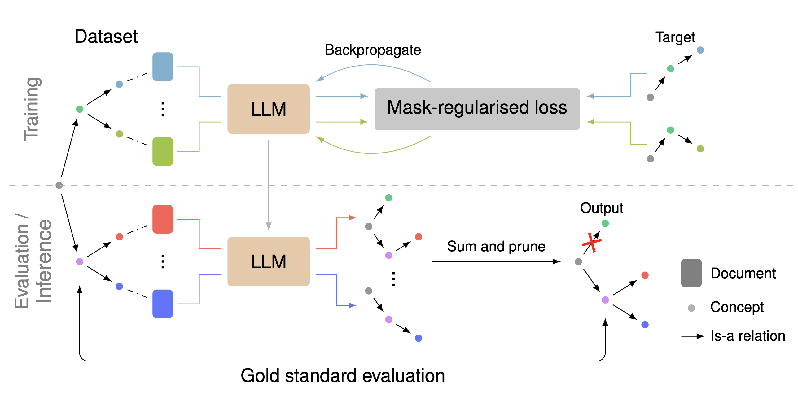

# OLLM

This is the source code for [End-to-End Ontology Learning with Large Language Models](https://arxiv.org/abs/2410.23584), NeurIPS 2024.



Abstract:
> Ontologies are useful for automatic machine processing of domain knowledge as they represent it in a structured format. Yet, constructing ontologies requires substantial manual effort. To automate part of this process, large language models (LLMs) have been applied to solve various subtasks of ontology learning. However, this partial ontology learning does not capture the interactions between subtasks. We address this gap by introducing OLLM, a general and scalable method for building the taxonomic backbone of an ontology from scratch. Rather than focusing on subtasks, like individual relations between entities, we model entire subcomponents of the target ontology by finetuning an LLM with a custom regulariser that reduces overfitting on high-frequency concepts. We introduce a novel suite of metrics for evaluating the quality of the generated ontology by measuring its semantic and structural similarity to the ground truth. In contrast to standard metrics, our metrics use deep learning techniques to define more robust distance measures between graphs. Both our quantitative and qualitative results on Wikipedia show that OLLM outperforms subtask composition methods, producing more semantically accurate ontologies while maintaining structural integrity. We further demonstrate that our model can be effectively adapted to new domains, like arXiv, needing only a small number of training examples. Our source code and datasets are available at https://github.com/andylolu2/ollm.

## Installation

This project uses [pixi](https://pixi.sh/latest/) to manage dependencies (because there non-Python dependencies). After installing pixi, run the following command to install the project dependencies:
```sh
pixi install
```

## Datasets

Our dataset are available on the Hugging Face Hub: Wikipedia categories dataset [`andylolu24/wiki-ol`](https://huggingface.co/datasets/andylolu24/wiki-ol) and arXiv dataset [`andylolu24/arxiv-ol`](https://huggingface.co/datasets/andylolu24/arxiv-ol).

To rebuild the dataset from scratch:

Wikipedia:
```sh
./entrypoints/dataset/build_wikipedia.sh
```

arXiv:
```sh
./entrypoints/dataset/build_arxiv.sh
```

## Models

Our OLLM models are available on the Hugging Face Hub: Wikipedia model [`andylolu24/ollm-wikipedia`](https://huggingface.co/andylolu24/ollm-wikipedia) and arXiv model [`andylolu24/ollm-arxiv`](https://huggingface.co/andylolu24/ollm-arxiv).

To train the model from base model (`Mistral-7B-Instruct-v0.2`):

Wikipedia:
```bash
# Download our dataset
./entrypoints/dataset/download_wikipedia.sh
# Format the dataset for training
./entrypoints/dataset/linearise_wikipedia.sh
# Train the model
./entrypoints/ollm/train_wikipedia.sh
```

arXiv:
```sh
# Download our dataset
./entrypoints/dataset/download_arxiv.sh
# Format the dataset for training
./entrypoints/dataset/linearise_arxiv.sh
# Train the model
./entrypoints/ollm/train_arxiv.sh
```

## Baselines

Baseline results can be reproduced by the scripts in the following directories:
```
entrypoint/
└── baselines/
    ├── hearst
    ├── llms4ol
    ├── memorisation
    ├── prompting
    └── rebel
```
